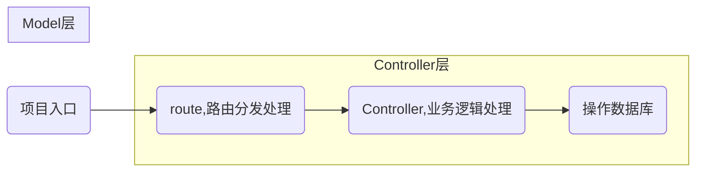

# vue
 vue学习

## 后端中的 MVC 与 前端中的 MVVM 之间的区别
 + MVC 是后端的分层开发概念；
 + MVVM是前端视图层的概念，主要关注于 视图层分离，也就是说：MVVM把前端的视图层，分为了 三部分 Model, View , VM ViewModel

```mermaid
graph LR;
  A(项目入口)-->B;
  subgraph Controller层
    B(route,路由分发处理)-->C;
    C(Controller,业务逻辑处理)-->D;
  end
  subgraph Model层
    D(操作数据库);
  end
```